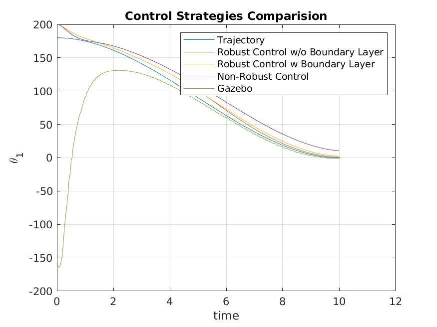
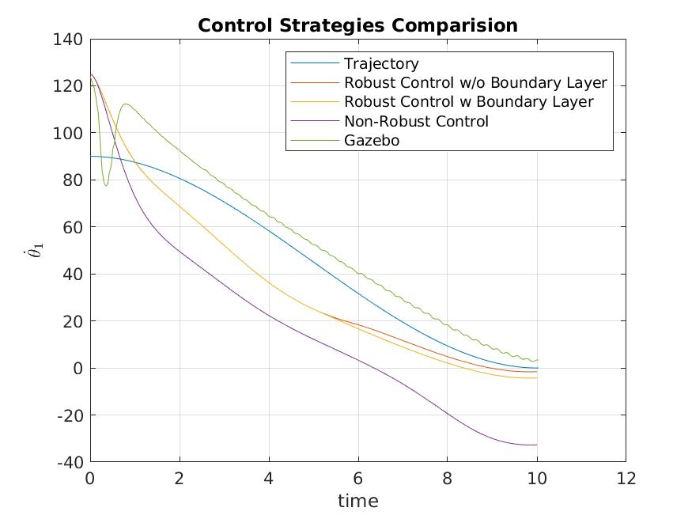
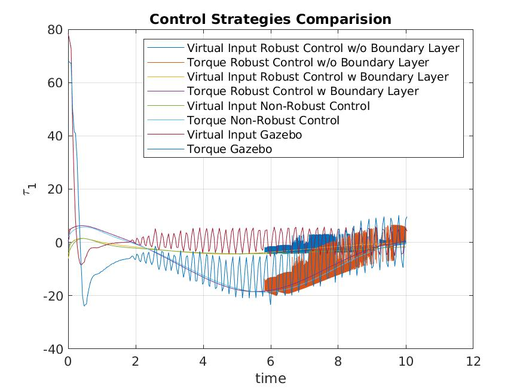
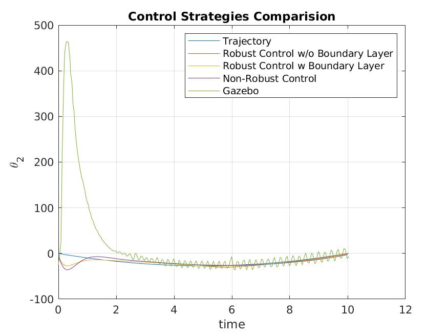
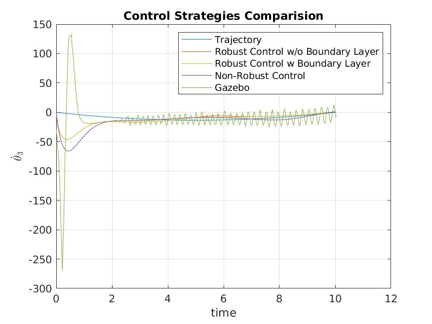
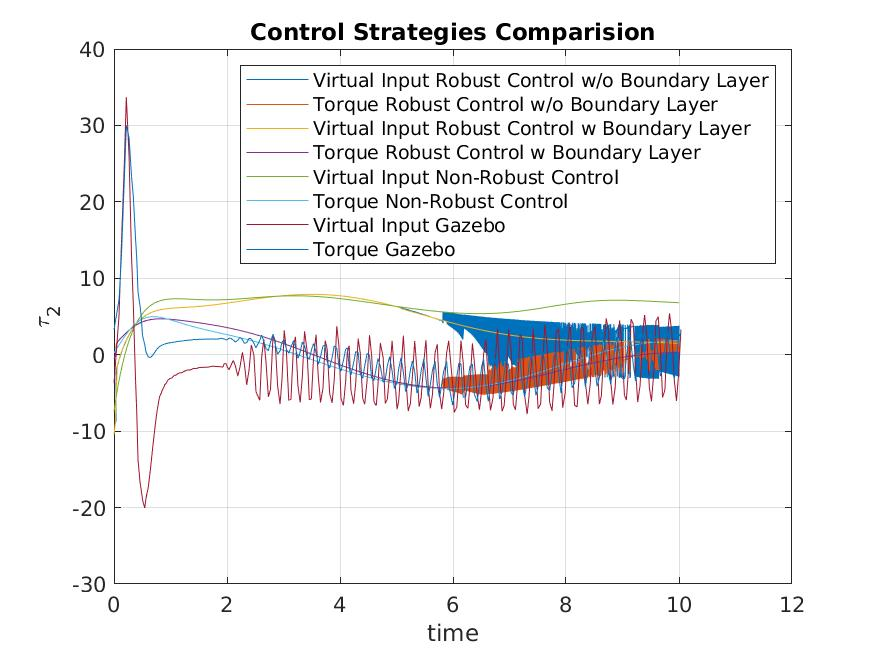

**Trajectory Tracking using Robust Controller for a 2 DoF RRBot**

<!-- TOC -->

- [About](#about)
- [How to Design a Robust Controller](#how-to-design-a-robust-controller)
    - [Derive Manipulator Form](#derive-manipulator-form)
    - [Derive the component of virtual input](#derive-the-component-of-virtual-input)
- [Code](#code)
    - [MATLAB](#matlab)
    - [Gazebo and ROS](#gazebo-and-ros)
- [Performance Comparision](#performance-comparision)
- [Designer Details](#designer-details)
- [License](#license)

<!-- /TOC -->

# About

The assignment aims to design Robust Controller for a 2-DoF Revolute Revolute Arm for Trajectory Tracking.

The project uses the Equation of Motion derived in this [project](https://github.com/parth-20-07/2-DoF-Revolute-Revolute-robot-arm-Equation-of-Motion) for the identical RRBot.

The assignment aims to design a polynomial trajectory of 3rd order and design a controller based on Robust Controller for the RRBot. The manipulator form is used for this approach which is of the form:

$$
M(q)\ddot{q} + C(q,\dot{q})\dot{q} + Tg(q)=Bu
$$

This form is derived by sorting terms from the standard state-space equation.

# How to Design a Robust Controller

## Derive Manipulator Form

Rearrange the terms of the state space equation from the form

$$
\dot{z} = f(z,u)
$$

to

$$
M(q)\ddot{q} + C(q,\dot{q})\dot{q} + Tg(q)=Bu
$$

## Derive the component of virtual input

Write the virtual input controller in the form:

$$
\begin{equation}\notag
v = M(q)
\begin{bmatrix}
v_{1}\\
v_{2}
\end{bmatrix} + C(q,\dot{q})\dot{q} + Tg(q)
\end{equation}
$$

# Code

## MATLAB
The complete calculation has been done [here (webpage form)](https://htmlpreview.github.io/?https://github.com/parth-20-07/Trajectory-Tracking-using-Robust-Controller-for-a-2-DoF-RRBot/blob/main/Solution/MATLAB/main.html) in MATLAB.

## Gazebo and ROS

The same system is simulated with the equations of motion present in Gazebo with real-world physics replication as shown [here (webpage form)](https://htmlpreview.github.io/?https://github.com/parth-20-07/Trajectory-Tracking-using-Robust-Controller-for-a-2-DoF-RRBot/blob/main/Solution/GAZEBO/rrbot_traj_control.html).

# Performance Comparision

- **$\theta_{1}$ vs $t$**

  
  
- **$\dot{\theta_{1}}$ vs $t$**

  
  
- **$\tau_{1}$ vs $t$**

  

- **$\theta_{2}$ vs $t$**

  
  
- **$\dot{\theta_{2}}$ vs $t$**

  
  
- **$\tau_{2}$ vs $t$**

  

**Possible Reasons for difference:**
- The lack of friction in the MATLAB System.
- The estimated value of gravitational acceleration in MATLAB.

# Designer Details

- Designed for:
  - Worcester Polytechnic Institute
  - RBE502 - Robot Control
- Designed by:
  - [Parth Patel](mailto:parth.pmech@gmail.com)

# License

This project is licensed under [GNU General Public License v3.0](https://www.gnu.org/licenses/gpl-3.0.en.html) (see [LICENSE.md](LICENSE.md)).

Copyright 2023 Parth Patel

Licensed under the GNU General Public License, Version 3.0 (the "License"); you may not use this file except in compliance with the License.

You may obtain a copy of the License at

_https://www.gnu.org/licenses/gpl-3.0.en.html_

Unless required by applicable law or agreed to in writing, software distributed under the License is distributed on an "AS IS" BASIS, WITHOUT WARRANTIES OR CONDITIONS OF ANY KIND, either express or implied. See the License for the specific language governing permissions and limitations under the License.
